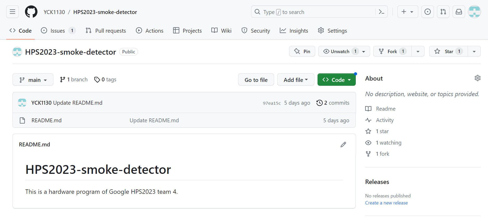

# Develop Flow

### Step 1. Fork a copy from the [main repo](https://github.com/YCK1130/HPS2023-smoke-detector) to your personal repo



### Step 2. Clone the repo to your local machine

```bash
# USERNAME – your Github user account name.
git clone git@github.com:${USERNAME}/HPS2023-smoke-detector.git
git
cd HPS2023-smoke-detector
# set upstream
git remote add upstream git@github.com:YCK1130/HPS2023-smoke-detector.git

# Don't push to the upstream main
git remote set-url --push upstream no_push

# check your setup
git remote -v
```

### Step 3. Create a Github Issue on YCK1130/HPS2023-smoke-detector


### Step 4. Create a local branch for your contribution

```bash
cd HPS2023-smoke-detector

# Make your local main up-to-date
git checkout main
git fetch upstream
git rebase upstream/main

# You can check your local commits
# make sure they are the same as the remote YCK1130/HPS2023-smoke-detector repo
	git log --oneline --graph --all

# Create a new branch for the new issue ESP-#{ISSUE_ID}/RPi-#{ISSUE_ID}
# If using zsh, add "" for branch name
	git checkout -b ESP-#{ISSUE_ID}
	# Example
*# git checkout -b ESP-#9
# git checkout -b "ESP-#9" // for zsh*

```

### Step 5. Develop & Create commits

```bash
git add ${edited files}
git commit -m "ESP-#{ISSUE_ID} ${Commit Message}"
# Example
# git commit -m "ESP-#9. Update pull_request_template"
```

### Step 6. Sync your local branch with upstream/main

```bash
git fetch upstream
# on your branch
git rebase upstream/main
```

### Step 7. Push your local branch to your repository

ps. 不是 YCK1130/HPS2023-smoke-detector，而是 <你的 Github>/HPS2023-smoke-detector

```bash
git push origin ESP-#{ISSUE_ID}
# 若你有 rebase 到東西的話，是有可能沒有辦法直接 push 上去
# 這樣的話就可能要 push -f
# **切記：千萬不要打 pull，他可能會跟你說請你 pull，你也不要 pull**
```

### Step 8. Create a pull request on Github


### Step 9. The Review process

-   所有人都可以幫別人 review 並給意見
-   覺得沒有問題可以打 "LGTM"，意思是 Looks Good To Me
-   大頭會幫你們把 PR Merge 進去
    -   合進去時請用 **Squash and merge** 選項，並使用 PR title 當作 commit message
    -   PR title 應該要長成 `#{issue_number} {issue_title}` 的形式

### Step 10. Finish

若你的 PR 有成功 link 到對應的 Issue， PR 被合進去後 Issue 會自動變成 closed.

Reference:

[https://git-scm.com/docs/git-rebase](https://git-scm.com/docs/git-rebase)

[https://docs.github.com/en/pull-requests/collaborating-with-pull-requests/proposing-changes-to-your-work-with-pull-requests/about-pull-requests](https://docs.github.com/en/pull-requests/collaborating-with-pull-requests/proposing-changes-to-your-work-with-pull-requests/about-pull-requests)

[https://docs.github.com/en/issues/trying-out-the-new-projects-experience/about-projects](https://docs.github.com/en/issues/trying-out-the-new-projects-experience/about-projects)

臺大電機之夜光舞 workflow
